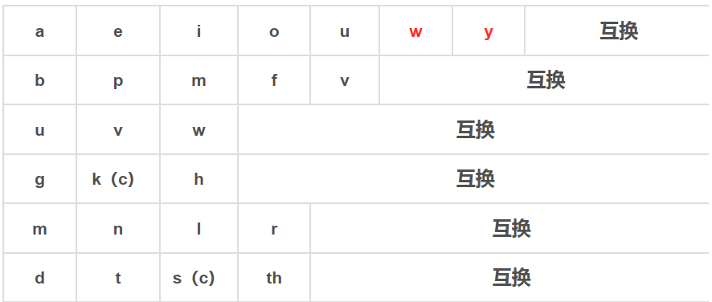

---
一种显示方式，只能用于文章的开头。 
typora-copy-images-to: ./images
---
**目录**

[toc]

# 一级标题

## 二级标题

### 三级标题


> 块引用第一段
> 
> > 内嵌的块引用第一段
> >
> > 内嵌的块引用第二段 
>
> 块引用第二段

+ 无序列表
+ 无序列表

1. 有序列表
2. 有序列表

### 三级标题


- [ ] 这是一个未完成任务的任务列表
- [ ] 增加一个未完成的任务列表
- [x] 这是一个已完成任务的任务列表

``` c++
int main()
{
	print("写入一个代码块");
    return 0;
}
```

$$
输入公式
$$


$$
\mathbf{V}_1 \times \mathbf{V}_2 =  \begin{vmatrix}  \mathbf{i} & \mathbf{j} & \mathbf{k} \\ \frac{\partial X}{\partial u} &  \frac{\partial Y}{\partial u} & 0 \\ \frac{\partial X}{\partial v} &  \frac{\partial Y}{\partial v} & 0 \\ \end{vmatrix}
$$

| 第一列(左对齐) | 第二列（居中） | 第三列（右对齐） |
| :------ | :------: | ------: |
|_另一种斜体_|__另一种粗体__|___另一种粗斜体___|
| *斜体* | **粗体** | ***粗斜体*** |
||||


此处是指向[一级标题](#一级标题)的链接

此处指向本文的[第一个"三级标题"](#三级标题-1)

此处指向本文的[第二个"三级标题"](#三级标题-2)

此处指向[move-to-finland.md文件中的taxation部分](..\move to finland\move-to-finland.markdown#税制(Taxation))

此处指向[文献管理与信息分析文件中的命令检索部分](..\document management and information analysis\note.md#命令检索)

<a name="标定物的地址"></a> 标定物


##### Delete Row in Table

The delete line command (Shift+Alt+Ctrl/Command+L) or delete table row command (Shift+Ctrl/Command+Backspace) will delete current table row in a table, or use the Context menu (right click).

##### Add/Delete Column in Table

Right click on a table cell, and in the Context menu, there are menu items for add/remove table columns.

##### Move Row/Column

It’s easy to reorder rows/columns . Just click on the left/top border of a row/column, and use drag and drop to move it

在这里创建一个脚注[^一个脚注]


画一条横线：

---
在画一条横线:
***
**创建一个如何使用markdown作图的[链接](https://support.typora.io/Draw-Diagrams-With-Markdown/).**

Ctrl + 单击 [引用](#一级标题) 将跳转到标题 `一级标题`处。


可以将链接单独进行定义,比如点击[百度][地址标识]可以访问百度网址,需要在文章的任何位置,定义百度的地址.
我在下面一行定义百度的地址:

[地址标识]:http://www.baidu.com


或者不对链接命名,直接点击[google][],这样google就作为了链接的名称,定义如下:

[google]:http://google.com


用HTML的方式访问google <a href="http://www.google.com">Link to Google</a>

标识URL的方式:     <www.google.com>

图片的格式:


插入一张图片：


再次插入一张图片：


**创建一个Typora如何处理图片的[链接](https://support.typora.io//Images/)**


要在用作强调分隔符的位置生成文字星号或下划线，可以用反斜杠转义：

\*这个文字被文字星号包围\* 


这是一句话当中产生的`printf(“代码块”)`代码。


要删除文字，用法为： ~~要删除的文字~~

对文字加下划线 ：<u>下划线</u> 

<a href="#标定物的地址">指向标定物</a>


使用内联公式，首先，请在 `偏好设置` 面板 -> `Markdown扩展语法` 选项卡中启用它。 $\lim_{x \to \infty} \exp(-x) = 0$


使用下标，首先，请在 `偏好设置` 面板 -> `Markdown扩展语法` 选项卡中启用它。然后用 `~` 来包裹下标内容，例如： H~2~O, X~long\ text~  


使用上标，首先，请在 偏好设置 面板 -> Markdown扩展语法 选项卡中启用它。然后用 ^ 来包裹上标内容，例如： X^2^。


使用高亮，首先，请在 偏好设置 面板 -> Markdown扩展语法 选项卡中启用它。然后用 == 来包裹高亮内容，例如： ==highlight==。


您可以使用==HTML==来设置纯 Markdown 不支持的内容，例如， <span style="color:red">this text is red</span> 用于添加红色文

<span style="font-size:1rem; background:pink;">**Bigger**</span>


  <kbd>Ctrl</kbd>+<kbd>P</kbd>


[Math and Academic Functions](https://support.typora.io/Math/)


$\ce{CH4 + 2 $\left( \ce{O2 + 79/21 N2} \right)$}$


[^一个脚注]: 这就是脚注 
