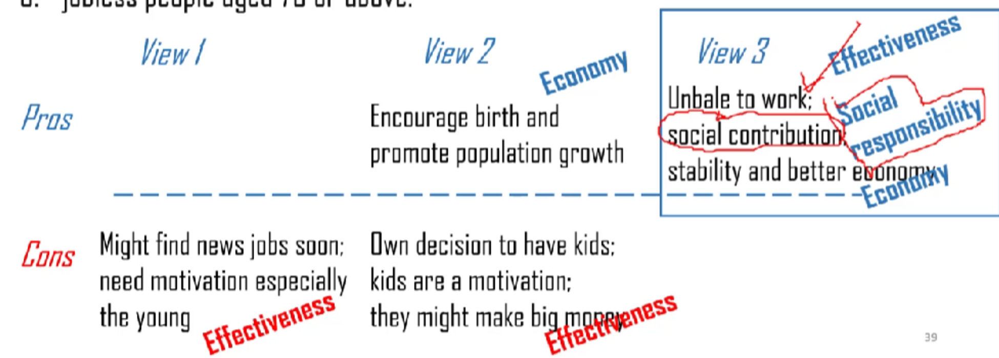

[toc]

## Session 1 Brainstorming

## A reservoir of high-level points

### Effectiveness and Efficiency

- **Better or faster results?**
- **Solve problems at the fundamental level** instead of applying a band-aid?
- **Incur new problems?**

## Session 5 - Multiple Choices

Template

- Prompt analysis & Brainstorming
- Opening
- Point 1 with reasoning
- Point 2 with exemplification
- Point 3 with concession
- Ending

### **Prompt analysis & Brainstorming**

Who do you think **most need and deserve financial help from the government**?

1. people who just lost jobs

- Cons: Might find new jobs soon; need motivation especially the young
  - Effectiveness

2. young couple/ people who have children

- Pros: Encourage birth and promote population growth
  - Economy
- Cons: Own decision to have kids; kids are a motivation; they might make big money
  - Effectiveness

3. jobless people aged 70 or above

- Pros: unable to work; social contribution; stability and better economy
  - Effectiveness
  - Social responsibility
  - Economy

### Grand Opening

(Prompt paraphrase) is an issue that has been debated for an extended period of time among citizens.

However, such ideas have to be scrutinized meticulously before a conclusion can be reached.

As far as (Point 1), (Point 2), and (Point 3) are concerned, I strongly hold that (our response).

Which group of people

### Point 1 with reasoning

**Template**

First and foremost, (Point 1), as (Fact 1).

Meanwhile, (Fact 2).

Not to mention that (**Fact 3 on other choices**). (少写)

**Example**

First and

**Tips**

- More on our side
- No need to cover all choices in one paragraph
- Emphasize on the point
- Word count 120-130

### Point 2 with exemplification

**Example**

Furthermore, the fact that the elder usually already have done their part in contributing to the society indicates that the government should shoulder the responsibility of taking care of them.

Take the case of the various forms of social benefits provided to citizens over 65 or 70 in many countries around the world, such as free or subsidized healthcare, for example: the elders have raised their future generations at home, participated in the building of their motherland at work, and some even served in the military to fight against invaders at the cost of their lives. As a result, the elders deserve to be treated well by the society.

Had it not been for the elders, we would never have been able to live in **a stable and prosperous society**. (承上启下）

**Tips**

1. General phenomenon as an example
2. Synergy with other paragraph
3. Word count 120-150

### Point 3 - concession

**Template**

- The ”YES”
- The “BUT”
- Point 3

**Example**

Nevertheless, a voice arises that a governmental financial support can help those who just lost jobs to find new jobs sooner and sustain a tough period of time, and support to those who have kids will encourage the young to give birth to kids, resulting in a stable population growth and stronger economic growth.

Ironically, people then will leave their current jobs casually and rely on the support for a long time, resulting in a chaotic economic instability; meanwhile, population growth is a complex process that requires supports from all aspects of the society, including education and infrastructure, and a mere financial support to young couples could lead to heavy demand on social resources.

Therefore, for the sake of a stable social economy, governmental financial support ought to be distributed to those who deserve and need it the most - jobless people over 70.

**Tips**

- No need to cover all choices in one paragraph bu**t in the whole passage.**

### End